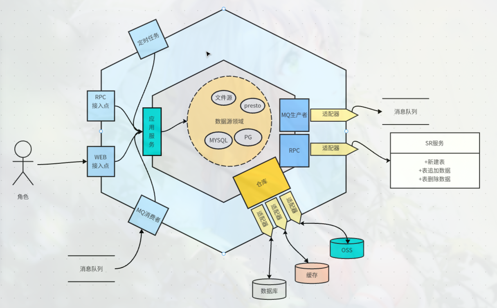
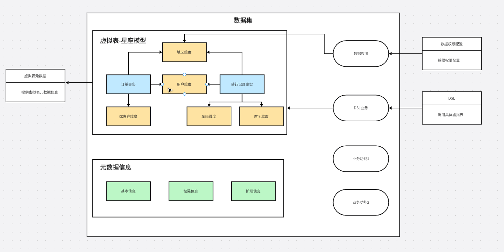
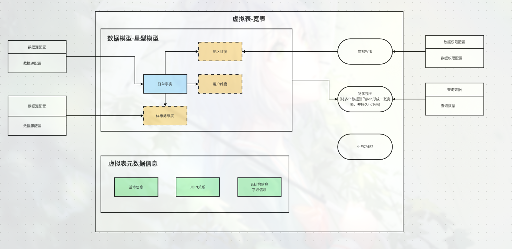
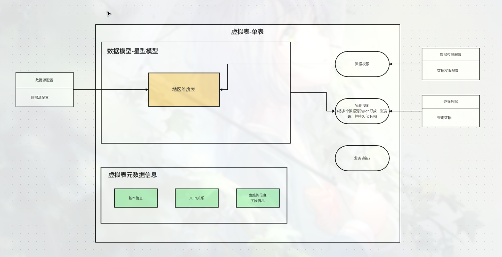

# 物理表

物理表支持多种类型,一个物理表仅提供一张表的元数据信息

1、数据源info

2、获取数据的能力

3、表结构

# 数据集

数据集由虚拟表组成图结构,每一个节点都是一个虚拟表。

每一个虚拟表都可以单独的进行分析也可以同时分析这个数据集下的所有虚拟表
以图中为例 这个数据集有7个虚拟表。

当我想知道，订单用户数，总用户数，骑行用户数分别是多少时？

我需要查询订单事实宽表，用户维表，骑行记录事实表三个虚拟表

## 虚拟表

### 虚拟表宽-表

订单事实表和用户维度表和地区维度表和优惠券维度表进行聚合后，生成一张宽表。

在我的设想中，一个虚拟表可以包含多个数据源。(比如订单宽表来自4个数据源的join)

### 虚拟表宽-单表

该示例为单表的情况

一张单表来自一个数据源

### 虚拟表-元数据

虚拟表结构包含以下信息:

1、baseSQL

2、指标 （度量为原始指标），指标可以定义自定义函数

3、维度

4、业务日期 (业务日期由维度提供)

#### 指标

虚标表